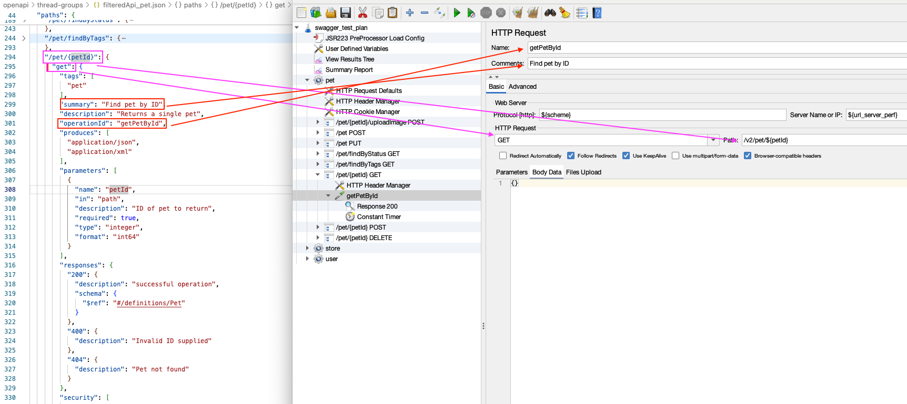

# OpenAPI_to_JMeter

## Introduction

Modern applications often rely on hundreds of APIs and thousands of endpoints. Each one demands rigorous performance testing to ensure speed, reliability and scalability. However, manually building test plans for every endpoint in JMeter can be error-prone and time-consuming.

This project, OpenAPI_to_JMeter solves this challenge by automatically converts your OpenAPI (Swagger) definitions into fully functional JMeter test plans. It builds entirely in JavaScript. It parses the API specification and dynamically constructs a ready-to-use .jmx file.

## Features

- Fully customizable Test Plans

  - Generates JMeter plans with configurable elements, such as User Defined Variable, HTTP Header Manager, and more.

- Well Structure

  - The project creates thread groups per API and organizes endpoints within loop controller.

- Extract JSON value into xml elements

## Project Structures

### JavaScript

The JavaScript, OpenAPI_to_JMeter project is constructed it files based on the JMeter’s Thread group and Looping controller.

The JavaScript project structure

<pre>
OpenAPI_to_JMeter/
├── src/
│   ├── generateJmx.js                       # Main script to generate .jmx
│   ├── threadGroup/
│   │   ├── threadGroupBuilder.js            # Adds thread group + config elements
│   │   └── loopControllerWithHttpRequest.js # Adds HTTP requests inside loop
│   ├── builders/
│   │   ├── testPlanBuilder.js               # Creates JMeter Test Plan block 
│   │   ├── jsr223Builder.js                 # Adds JS pre-processors
│   │   ├── timerBuilder.js                  # Adds throughput shaping timer
│   │   ├── userDefinedVariable.js           # Adds user-defined variables
│   │   ├── viewResultTree.js                # Visual listener
│   │   └── summaryReport.js                 # Summary report listener
│   └── jsonParser/
│       └── openapiParser.js                 # Optional: filters API by tag
├── openapi/
│   ├── swagger.json                         # Your OpenAPI spec
│   └── filteredApi.json                     # Targeted API extracted by tag
├── output/
│   └── test_plan.jmx                        # Generated output test plan
</pre>

### JMeter

The generated output JMeter file has configurable and ready-to-use xml elements. One Thread Group has per API, placing all its endpoints inside a Loop Controller for structured execution.

The outputed JMeter Project Structure

<pre>
Swagger_test_plan/
├── JSR223 PreProcessor                       # Adds pre-script logic (e.g., token parsing)
├── jp@gc - Throughput Shaping Timer          # Controls request rate
├── User Defined Variables                    # Custom global variables (e.g., base URL, credentials)
├── View Results Tree                         # Visual listener for debugging
├── Summary Report                            # Aggregated report after test run
└── Thread Group                              # One per API group
    ├── HTTP Request Defaults                 # Sets base path/host
    ├── HTTP Header Manager                   # Global headers (e.g., Authorization)
    ├── HTTP Cookie Manager                   # Handles session cookies
    └── Loop Controller                       # Contains all endpoints for this API
        ├── HTTP Header Manager               # Re-declare per-endpoint headers (if needed)
        └── HTTP Request                      # Endpoint request (e.g., GET /orders)
            ├── Response Assertion            # Check success criteria
            └── Constant Timer                # Wait time between requests
</pre>

## How it works

### JMeter

- JMeter Test Plan is build in XML format.

- Each JMeter element has its own tag name and the associated attributes. e.g.

```xml
<ThreadGroup testname="API" enabled="true">
  <stringProp name="ThreadGroup.num_threads">5</stringProp>
</ThreadGroup>
```

- It organizes the hierarchical test plan using `<hasTree>`. A paired `<hashTree>` wraps its child elements and and <hashTree/> is self closing element for each child element.

- By knowing this pattern, we can use xmlbuilder library in JavaScript to build our fully customized the xml elements into a test plan.

Expand to check out a simple JMeter XML Structure

```xml
<?xml version="1.0" encoding="UTF-8"?>
<jmeterTestPlan version="1.2" properties="5.0" jmeter="5.4.1">
  <hashTree>
    <TestPlan guiclass="TestPlanGui" testclass="TestPlan" testname="Test Plan" enabled="true">
      <!-- TestPlan settings go here -->
    </TestPlan>
    <hashTree>
      <ThreadGroup guiclass="ThreadGroupGui" testclass="ThreadGroup" testname="Example Thread Group" enabled="true">
        <!-- ThreadGroup settings go here -->
      </ThreadGroup>
      <hashTree>
        <HTTPSamplerProxy guiclass="HttpTestSampleGui" testclass="HTTPSamplerProxy" testname="GET Example" enabled="true">
          <!-- HTTP Sampler settings -->
        </HTTPSamplerProxy>
        <hashTree/>
      </hashTree>
    </hashTree>
  </hashTree>
</jmeterTestPlan>
```

### OpenAPI (Swagger) definitions

OpenAPI (Swagger) definitions are standardized, machine-readable documents that describe the structure and behavior of RESTful APIs. From the file describes, we can extract the information for our test place.

For example,

Extracts JSON value to xml



### JavaScript

The npm ecosystem offers a vast collection of libraries for various programming needs. Among them, xmlbuilder2 is a powerful library that enables us to build and manipulate XML documents, making it ideal for creating fully customized JMeter test plans.

```javascript
// import the xmlbuilder2 npm package, and using destructuring assignment to extract the create function.
const { create } = require("xmlbuilder2");
// Initializes a new XML document
const doc = create({ version: "1.0", encoding: "UTF-8" });
// Adds the root XML element <jmeterTestPlan> with required JMeter attributes.
const root = doc.ele("jmeterTestPlan", {
  version: "1.2",
  properties: "5.0",
  jmeter: "5.4.1",
});

// Add <hashTree> element user <jmeterTestPlan>, create a container to organize child elements
const mainTree = root.ele("hashTree");

// Calls the addTestPlan() function which returns an array of TestPlan element and its child elements.
const [testPlan, testPlanHashTree] = addTestPlan(mainTree);
```

## Usage

### In Visual Studio Code

- Execute file in the terminal, `node src/generateJmx.js` to generate the JMeter test plan

- Find your outputed .jmx file from directory and open it in Jmeter

## Future Enhancements

- More customizable JMeter xml element

  - Parses JSON value into Http Header Manager per http request

- Develop a user interface to make it user friendly.

- Deploy and publish this application.

<details>
<summary><strong></strong></summary>

</detail>
